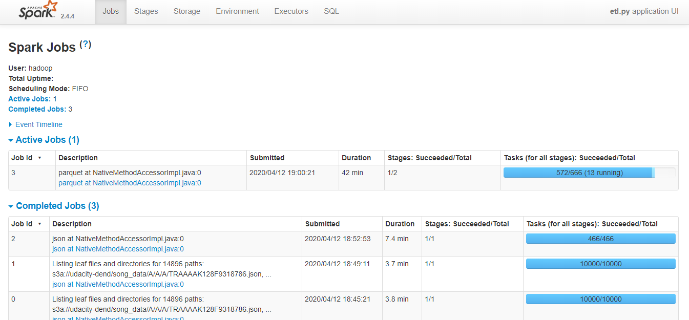

# Project: ETL Pipeline with PySpark and AWS S3 as a DataLake

This project is developed using the following concepts:

- Development of an ETL pipeline using PySpark
- Extracting Data from S3 using PySpark
- Transforming Data using PySpark SQL
- Data storage in S3 using parquet

## Main Objective

The objective of this project is to create an etl pipeline for the analytics team of a fictional music streaming service called Sparkify. Sparkify is a music streaming startup with a growing user base and song database.
Their user activity and songs metadata data resides in json files in S3. The goal of the current project is to build an ETL pipeline that extracts their data from S3 using `PySpark`, and transforming the data into a set of dimensional and fact tables for their analytics team to continue finding insights in what songs their users are listening to. The formatted tables are stored back in AWS S3 in `parquet` format (Here S3 is acting like a Data Lake). 

### Sample Data

The files in S3 are in json format and they are categorized as follows:

- **Song datasets**: The dataset contains  details of the songs from [Millon Songs Dataset](http://millionsongdataset.com/) in json files which are nested in subdirectories under */data/song_data*. A sample of this files is:

```
{"num_songs": 1, "artist_id": "ARJIE2Y1187B994AB7", "artist_latitude": null, "artist_longitude": null, "artist_location": "", "artist_name": "Line Renaud", "song_id": "SOUPIRU12A6D4FA1E1", "title": "Der Kleine Dompfaff", "duration": 152.92036, "year": 0}
```

- **Log datasets**: All the log json files are created using a [eventSimulator](https://github.com/Interana/eventsim) and they are nested in subdirectories under */data/log_data*. A sample of a single row of each files is:

```
{"artist":"Slipknot","auth":"Logged In","firstName":"Aiden","gender":"M","itemInSession":0,"lastName":"Ramirez","length":192.57424,"level":"paid","location":"New York-Newark-Jersey City, NY-NJ-PA","method":"PUT","page":"NextSong","registration":1540283578796.0,"sessionId":19,"song":"Opium Of The People (Album Version)","status":200,"ts":1541639510796,"userAgent":"\"Mozilla\/5.0 (Windows NT 6.1) AppleWebKit\/537.36 (KHTML, like Gecko) Chrome\/36.0.1985.143 Safari\/537.36\"","userId":"20"}
```

### Database Schema

#### Fact Table

`songplays` Table contains records in log data associated with song plays i.e. records with page NextSong
* *songplay_id, start_time, user_id, level, song_id, artist_id, session_id, location, user_agent*

#### Dimension Tables

`users` Table contains users in the app
* *user_id, first_name, last_name, gender, level*

`songs` contains songs in music database
* *song_id, title, artist_id, year, duration*

`artists` contains artists in music database
* *artist_id, name, location, lattitude, longitude*

`time` contains timestamps of records in songplays broken down into specific units
* *start_time, hour, day, week, month, year, weekday*

## Main Concepts

In this project I have primarily used the `PySpark` sql functions to do the etl of the `*.json` files provided. The main steps are as follows:

- Creating the `SparkSession`
- Loading the '*.json' files using `spark.read.format("json").load(log_data)`
- Using `selectExpr` where new tables have to be create from the json files
- Clean and process the raw data:
  * Adding unique row identifiers to all fact and dimension tables
  * Removing duplicate rows
  * Imputing nulls to desired values when necessary
  * Parsing Timestamps using datetime in a udf and extracting date components using `pyspark.sql.functions`
  * create the fact and dimension tables mentioned above
- Each of the five tables are written to parquet files in a separate analytics directory on AWS S3. Each table has its own folder within the directory
- Songs table files are partitioned by `year` and then `artist_id`. Time table files are partitioned by `year` and `month`. Songplays table files are partitioned by `year` and `month`

## Execution Steps

To create all the tables mentioned above follow the steps mentioned below:

1. Creating the DL config file, and save it as ```dl.cfg``` in the project root folder. The template is as follows

```
[AWS]
AWS_KEY=
AWS_SECRET=
```
##### **Executing in Local Mode**

2. Extract the `*.zip` 

3. Use the Jupyter notebook and to observe the steps follwed for this project

4. Modify the `etl.py` script with `input_data=./data/` and `output_data=./outFiles/`

5. Run the following command in the cmd prompt:

    `$ python etl.py`
   
    
6. After running the script the `outFiles` folder will have tables stored in parquet format 


##### **Executing in AWS EMR**

2. Copy the `etl.py` script to AWS EMR master node using the `scp` command or copy paste into the `nano etl.py` file 

3. Use the Jupyter notebook and to observe the steps follwed for this project

4. Modify the `etl.py` script with `input_data = "s3a://udacity-dend/"` and `output_data = "s3a://dend-spark-hari/"`

5. The data sources are located here:

  - `s3a://udacity-dend/song_data/*/*/*` - JSON files containing meta information about song/artists data
  - `s3a://udacity-dend/log_data/*/*` - JSON files containing log events from the Sparkify app

5. Run the following command in the cmd prompt of the AWS EMR master node:

    `$ /usr/bin/spark-submit --master yarn ./etl.py`
   
6. After running the script the tables in parquet format are stored in AWS S3

**During Execution**:

When the `etl.py` is executed in the AWS `EMR` cluster the progress can be viewed from the `Spark UI`:



#### Log Output

Once the execution of the script is completed the log output is as follows:

~~~bash
2020-04-12 19:36:36.595683 : Reading in the AWS credentials
****************************************************************************************************
2020-04-12 19:36:36.597180 : Creating Spark Session
2020-04-12 19:36:49.196273 : Spark Session Created !!!
****************************************************************************************************
2020-04-12 19:36:49.197060 : Pyspark script logger initialized
****************************************************************************************************
2020-04-12 19:36:49.197101 : Processing Song Data from input Folder
2020-04-12 19:36:49.197136 : Reading Song Data from input S3 Folder
2020-04-12 19:36:59.619607 : Finished Reading Song Data !!!                                                                                  
2020-04-12 19:36:59.620242 : Creating Songs Dimension Table
2020-04-12 19:36:59.751108 : Creating Songs Table Completed !!!
2020-04-12 19:36:59.751704 : Writing Songs table to S3
2020-04-12 19:37:10.917163 : Writing Songs Table to S3 Completed !!!                                                                         
2020-04-12 19:37:10.917669 : Creating Artists Dimension Table
2020-04-12 19:37:11.372985 : Creating Artists Table Completed !!!
2020-04-12 19:37:11.373518 : Writing Artists table to S3
2020-04-12 19:37:17.438669 : Writing Artists table to S3 Completed !!!                                                                       
2020-04-12 19:37:17.439183 : Song Data Processed
****************************************************************************************************
2020-04-12 19:37:17.439576 : Processing Log Data
2020-04-12 19:37:17.439621 : Reading Log Data from input S3 Folder
2020-04-12 19:37:19.332115 : Finished Reading Log Data !!!                                                                                   
2020-04-12 19:37:19.514550 : Creating Users Dimension Table
2020-04-12 19:37:19.543932 : Creating Users Table Completed !!!
2020-04-12 19:37:19.544423 : Writing Users table to S3
2020-04-12 19:37:25.785068 : Writing Users table to S3 Completed !!!                                                                         
2020-04-12 19:37:25.793363 : Creating Time Dimension Table
2020-04-12 19:37:25.960128 : Creating Time Table Completed !!!
2020-04-12 19:37:25.960644 : Writing Time table to S3
2020-04-12 19:37:38.096717 : Writing Time table to S3 Completed !!!                                                                          
2020-04-12 19:37:38.099358 : Reading Songs Table from S3
2020-04-12 19:37:38.780304 : Loading of Songs Table from S3 Completed !!!
2020-04-12 19:37:38.787264 : Reading Artists Table from S3
2020-04-12 19:37:38.951931 : Loading of Artists Table from S3 Completed !!!
2020-04-12 19:37:38.962496 : Creating songplays Fact Table using songs and artist table
2020-04-12 19:37:39.152249 : Creating songplays Fact Table Completed !!!
2020-04-12 19:37:39.152781 : Writing songplays table to S3
2020-04-12 19:37:51.782066 : Writing songplays table to S3 Completed !!!                                                                     
2020-04-12 19:37:51.782993 : Log Data Processed
****************************************************************************************************
~~~

### Star Schema

After the execution of the `etl.py` script the data can be found on the S3 bucket location. The parquet formatted can be loaded whenever necessary and can be queried according to the following schema for performing analytics


The ```songplay``` table references the primary keys of each dimention table, enabling joins to songplays on song_id, artist_id, user_id and start_time, respectively. I have generated the database schema ER Diagram using [SchemaSpy](http://schemaspy.org/) by the following command:

```
java -jar schemaspy.jar -t pgsql -dp C:/sqljdbc4-3.0.jar -db DATABASE -host SERVER -port 5432 -s dbo -u USER -p PASSWORD -o DIRECTORY
```

