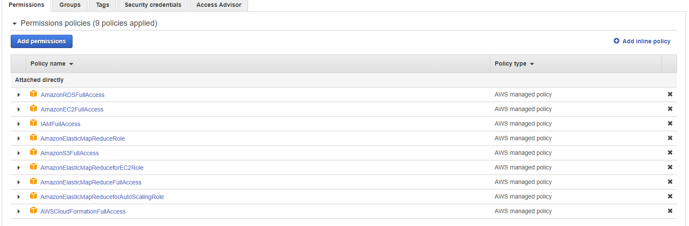

#### Capstone Project

##### Data Sources from Udacity
U1) I94 Immigration Data: This data comes from the US National Tourism and Trade Office. A data dictionary is included in the workspace. This is where the data comes from. There's a sample file so you can take a look at the data in csv format before reading it all in. You do not have to use the entire dataset, just use what you need to accomplish the goal you set at the beginning of the project.

U2) World Temperature Data: This dataset came from Kaggle. You can read more about it here.

U3) U.S. City Demographic Data: This data comes from OpenSoft. You can read more about it here.

U4) Airport Code Table: This is a simple table of airport codes and corresponding cities. It comes from here.

#### Creating AWS CloudFormation Stack

In order to run this project the following resources are needed:
- `AWS EC2` - a `m4.xlarge` instance is needed for executing `Apache Airflow`
- `Apache Airflow` - for orchestrating the ETL pipeline
- `AWS RDS` - for Airflow to store its metadata
- `AWS S3` - for creating the Data Lake
- `AWS EMR` - cluster with `Apache Spark` and `Apache Livy` are needed to perform `Transformation` tasks on the raw data

To make the provisioning of the above resources easier, I have used the `AWS Cloudformation` to create
the stack needed for running this project.

The resources needed are already configured in the [airflow_server.yaml](./airflow_server.yaml)

To start creating the resource the following steps are to be performed:
1) Create an `AWS` account and provide necessary billing information
2) Create a `user` from `AWS IAM`
3) For the `user` make sure the following permissions are provided in IAM

4) Finish the `user` creation step and  download the `AWS KEY ID` and `AWS SECRET` into a `csv` file
5) Create an `EC2 Key Pair` for accessing the EC2 instance for using `Airflow`

After finishing the above steps. Fill in the `dwh.cfg` with your details

Finally to create the cloud-formation stack use: `python create_resources.py`

##### External Data Sources
1) US Air Traffic and related meta data => can be combined with U4/U1
    - [http://stat-computing.org/dataexpo/2009/the-data.html](http://stat-computing.org/dataexpo/2009/the-data.html)
2) Financial Data Modeling 
    - [https://financialmodelingprep.com/developer/docs/](https://financialmodelingprep.com/developer/docs/)
    - [https://www.kaggle.com/borismarjanovic/price-volume-data-for-all-us-stocks-etfs](https://www.kaggle.com/borismarjanovic/price-volume-data-for-all-us-stocks-etfs)
3) Bike Share Data 
    - [https://www.kaggle.com/jackywang529/toronto-bikeshare-data](https://www.kaggle.com/jackywang529/toronto-bikeshare-data)
    - [https://www.lyft.com/bikes/bay-wheels/system-data](https://www.lyft.com/bikes/bay-wheels/system-data)
    - [https://github.com/BetaNYC/Bike-Share-Data-Best-Practices/wiki/Bike-Share-Data-Systems](https://github.com/BetaNYC/Bike-Share-Data-Best-Practices/wiki/Bike-Share-Data-Systems)
4) US Accidents Data => can be combined with U3
    - [https://www.kaggle.com/sobhanmoosavi/us-accidents](https://www.kaggle.com/sobhanmoosavi/us-accidents)
